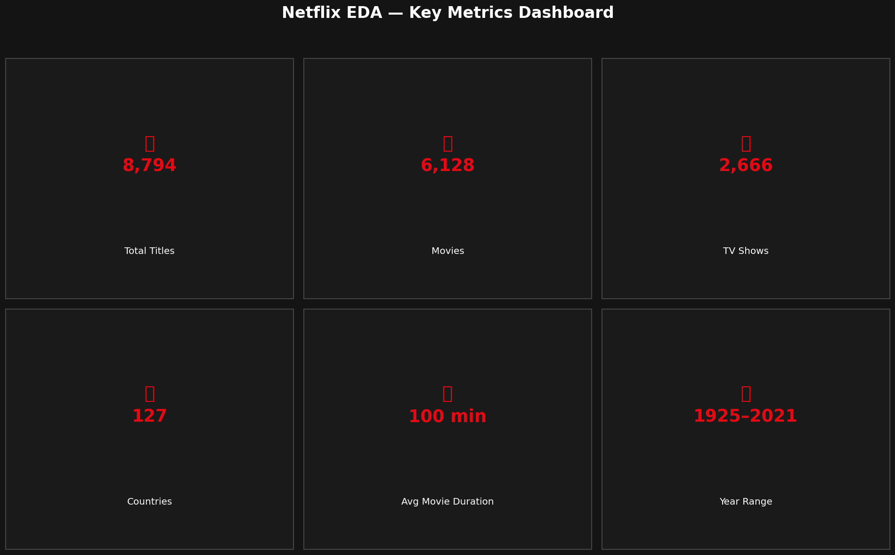
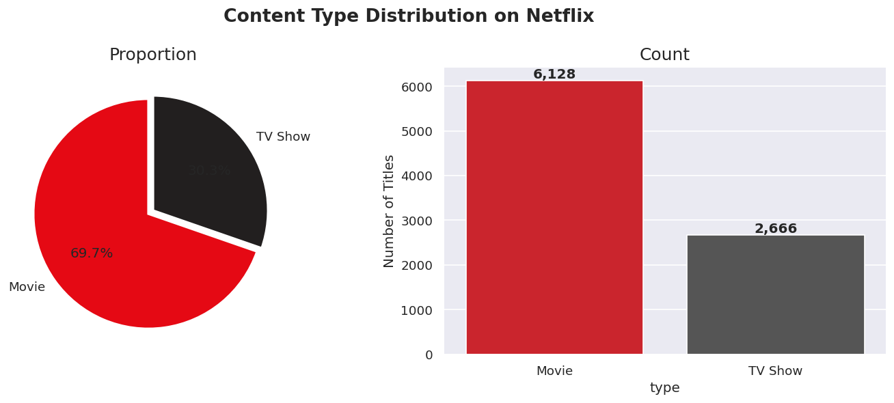
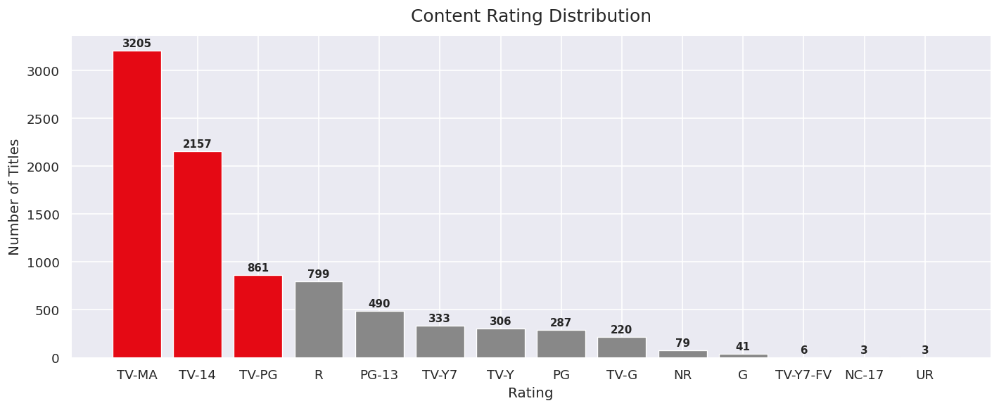
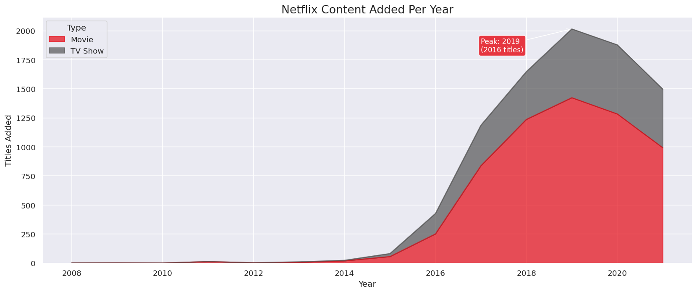
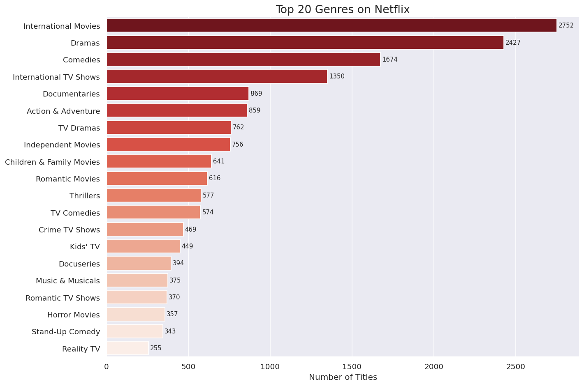
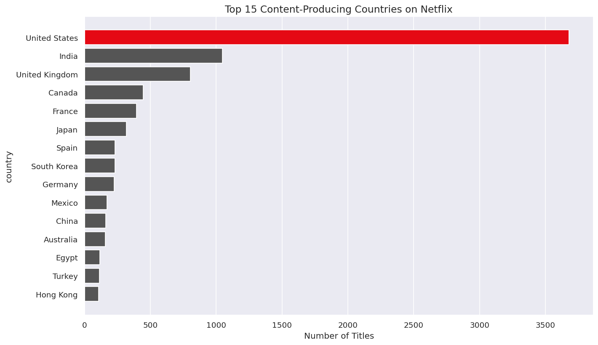
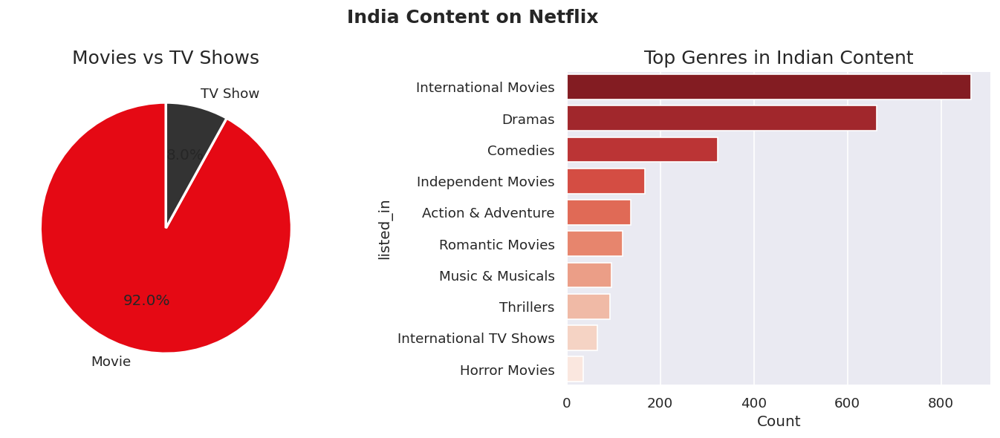
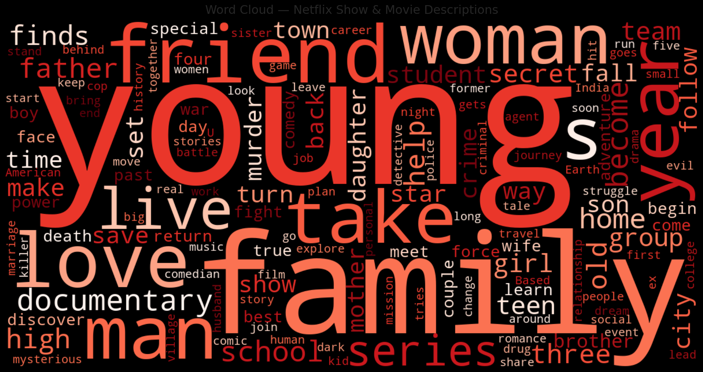

# 🎬 Netflix Content Analysis — Exploratory Data Analysis



> A comprehensive EDA project exploring 8,800+ Netflix titles across Movies and TV Shows — analyzing content trends, genres, countries, ratings, and growth patterns.

---

## 📌 Table of Contents
- [Project Overview](#-project-overview)
- [Dataset](#-dataset)
- [Key Findings](#-key-findings)
- [Visualizations](#-visualizations)
- [Tech Stack](#-tech-stack)
- [How to Run](#-how-to-run)
- [Project Structure](#-project-structure)

---

## 🔍 Project Overview

This EDA project answers questions like:
- How many Movies vs TV Shows are on Netflix?
- Which countries produce the most Netflix content?
- When does Netflix add the most new content?
- What are the most popular genres?
- How long are typical Netflix movies?

---

## 📊 Dataset

| Attribute | Detail |
|-----------|--------|
| Source | [Kaggle — Netflix Movies and TV Shows](https://www.kaggle.com/datasets/shivamb/netflix-shows) |
| Records | 8,807 titles |
| Features | 12 columns |
| Time Range | 1925 – 2021 |

**Columns:** `show_id`, `type`, `title`, `director`, `cast`, `country`, `date_added`, `release_year`, `rating`, `duration`, `listed_in`, `description`

---

## 💡 Key Findings

| # | Insight |
|---|---------|
| 1 | **Movies dominate** — ~70% of all Netflix content is Movies |
| 2 | **TV-MA** is the most common rating — Netflix targets mature audiences |
| 3 | Average movie length is **~99 minutes** |
| 4 | **~68%** of TV Shows have only 1 season |
| 5 | Content additions **peaked in 2019** with 2,000+ new titles |
| 6 | **July** sees the highest monthly content additions |
| 7 | **International Movies & Dramas** are the top genres globally |
| 8 | **USA leads** production; **India is #2** with 972 titles 🇮🇳 |

---

## 📈 Visualizations

<table>
  <tr>
    <td><br><em>Movies vs TV Shows</em></td>
    <td><br><em>Content Ratings</em></td>
  </tr>
  <tr>
    <td><br><em>Yearly Content Growth</em></td>
    <td><br><em>Top 20 Genres</em></td>
  </tr>
  <tr>
    <td><br><em>Top Countries</em></td>
    <td><br><em>India Content Focus</em></td>
  </tr>
  <tr>
    <td colspan="2"><br><em>Word Cloud — Show Descriptions</em></td>
  </tr>
</table>

---

## 🛠 Tech Stack

| Library | Purpose |
|---------|---------|
| `pandas` | Data loading, cleaning, manipulation |
| `numpy` | Numerical operations |
| `matplotlib` | Core plotting |
| `seaborn` | Statistical visualizations |
| `wordcloud` | Word frequency visualization |

---

## 🚀 How to Run

### 1. Clone the repository
```bash
git clone https://github.com/YOUR_USERNAME/netflix-eda.git
cd netflix-eda
```

### 2. Install dependencies
```bash
pip install -r requirements.txt
```

### 3. Launch Jupyter Notebook
```bash
jupyter notebook Netflix_EDA.ipynb
```

Or run all cells at once:
```bash
jupyter nbconvert --to notebook --execute Netflix_EDA.ipynb
```

---

## 📁 Project Structure

```
netflix-eda/
│
├── Netflix_EDA.ipynb       ← Main analysis notebook
├── netflix_titles.csv      ← Dataset
├── requirements.txt        ← Python dependencies
├── README.md               ← This file
│
└── plots/                  ← Generated visualizations
    ├── 02_content_type.png
    ├── 03_ratings.png
    ├── 04_movie_duration.png
    ├── 05_tv_seasons.png
    ├── 08_yearly_growth.png
    ├── 09_monthly_additions.png
    ├── 10_top_genres.png
    ├── 11_top_countries.png
    ├── 12_india_content.png
    ├── 13_wordcloud.png
    └── 14_dashboard.png
```

---

## 👤 Author

Manish Kumar
📧 mkumar.code24@gmail.com
🔗 [LinkedIn](https://linkedin.com/in/Manishkumar) | [GitHub](https://github.com/ManishKumar2026)

---

## 📄 License

This project is open-source under the [MIT License](LICENSE).

---

*⭐ If you found this project helpful, please consider giving it a star!*
